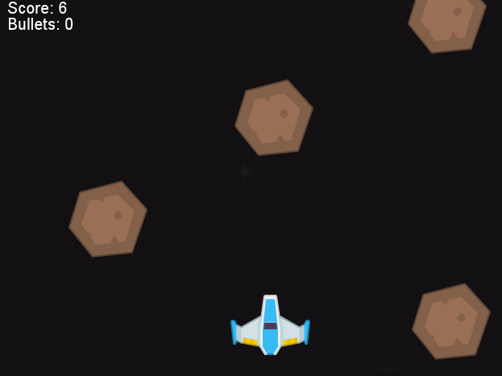

# Qngine Typescript Example:
A Top-down Space Shooter Game in [Qngine](https://github.com/QwertyR0/Qngine).  
Credits to [Kenney](https://www.kenney.nl/) for making all of the assets.

## Controls:
Use "WASD" to move. "Enter" to fire lasers(bullets).
You get a bullet once every 8 score points.

